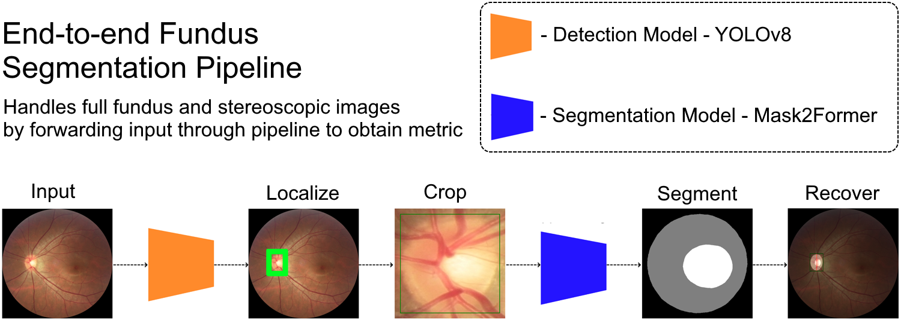
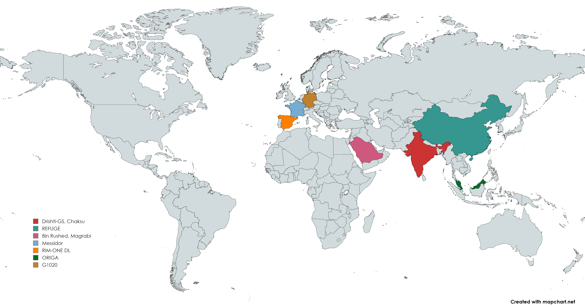

# Detection and Segmentation Pipeline

By Scott Kinder
scott.kinder@cuanschutz.edu

# Overview

This repo is broken down into 3 main parts:

1. [detection](./detection/) Detection
2. [segmentation](./segmentation/) Segmentation
3. [pipeline](./pipeline/) Pipeline end-to-end

# Architecture



# Data



We used 9 public datasets:

- [Chákṣu](https://www.ncbi.nlm.nih.gov/pmc/articles/PMC9898274/)
- [Drishti-GS](https://ieeexplore.ieee.org/document/6867807)
- [G1020](https://arxiv.org/abs/2006.09158)
- [ORIGA](https://pubmed.ncbi.nlm.nih.gov/21095735/)
- [REFUGE-1](https://refuge.grand-challenge.org/)
- [RIM-ONE-DL](https://www.ias-iss.org/ojs/IAS/article/view/2346)
- [RIGA](https://www.spiedigitallibrary.org/conference-proceedings-of-spie/10579/2293584/Retinal-fundus-images-for-glaucoma-analysis-the-RIGA-dataset/10.1117/12.2293584.full#_=_) (Composed of Bin Rushed, Magrabi, and Messidor)

## Python environment

There are requirements.txt files [here](./requirements.txt). This repo really just uses a couple standard Deep Learning libaries

- Pytorch
- OpenCV (cv2), PIL
- Numpy, Pandas, Matplotlib
- Ultralytics (for YOLO model)
- Albumentations (for image augmentations)

## Complete setup

### Download the models

See [Detection](./detection/README.md) and [Segmentation](./segmentation/README.md) modules for link to downloads

### Run from nothing to segmentation output

```sh
# Clone repo
git clone https://github.com/QTIM-Lab/fundus_detection_segmentation_pipeline.git
# Change dir
cd fundus_detection_segmentation_pipeline
# Create a venv (recommended)
python3 -m venv venv
# Activate venv
source venv/bin/activate
# Intall packages
pip install -r requirements.txt
# Install repo module
pip install -e .
# Run end to end pipeline with params
python pipeline/scripts/end_to_end.py \
    --detection_model_path /path/to/detect/model.pt \
    --segmentation_model_path /path/to/seg/model.pt \
    --input_dir /path/to/input/images \
    --output_dir /path/to/output/folder \
    --dataset_mean 0.768 0.476 0.290 \
    --dataset_std 0.220 0.198 0.166 \
    --cuda_num 0
