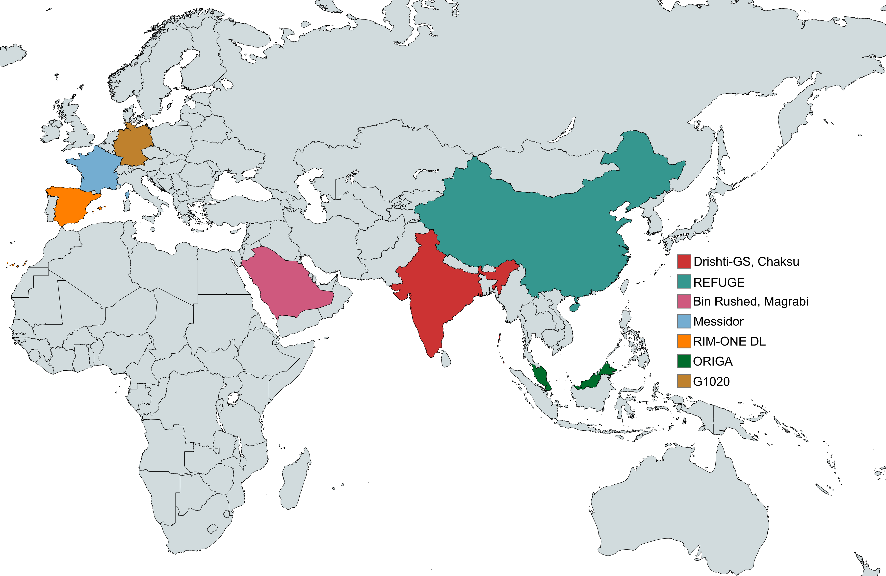

# Detection and Segmentation Pipeline

By Scott Kinder
scott.kinder@cuanschutz.edu

# Overview

This repo is broken down into 3 main parts:

1. [detection](./detection/) Detection
2. [segmentation](./segmentation/) Segmentation
3. [pipeline](./pipeline/) Pipeline end-to-end

# Architecture

# Data

We used 9 public datasets:

- [Chákṣu](https://www.ncbi.nlm.nih.gov/pmc/articles/PMC9898274/)
- [Drishti-GS](https://ieeexplore.ieee.org/document/6867807)
- [G1020](https://arxiv.org/abs/2006.09158)
- [ORIGA](https://pubmed.ncbi.nlm.nih.gov/21095735/)
- [REFUGE-1](https://refuge.grand-challenge.org/)
- [RIM-ONE-DL](https://www.ias-iss.org/ojs/IAS/article/view/2346)
- [RIGA](https://www.spiedigitallibrary.org/conference-proceedings-of-spie/10579/2293584/Retinal-fundus-images-for-glaucoma-analysis-the-RIGA-dataset/10.1117/12.2293584.full#_=_) (Composed of Bin Rushed, Magrabi, and Messidor)

## Python environment

There are requirements.txt files [here](./requirements.txt). This repo really just uses a couple standard Deep Learning libaries

- Pytorch
- OpenCV (cv2), PIL
- numpy, pandas, matplotlib
- ultralytics (for YOLO model)
- albumentations (for image augmentations)

I highly doubt that in the event you get a missing package that just pip installing it wouldn't work, but feel free to contact me if you think something is missing otherwise I think that's mostly it, and the requirements.txt files
