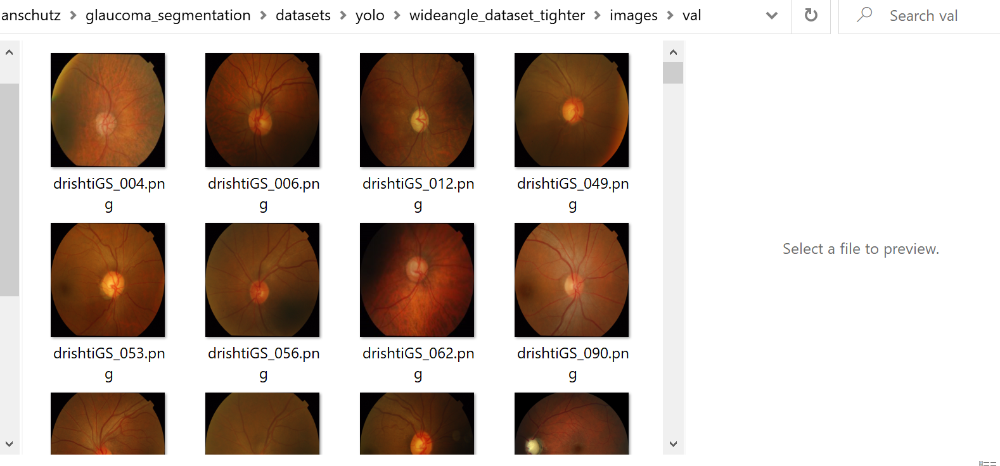
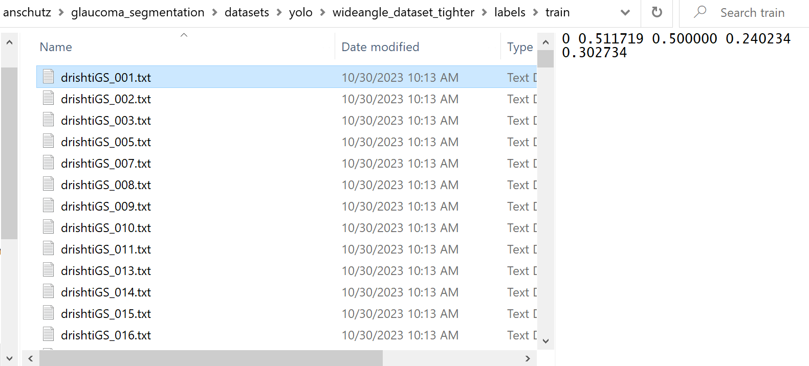

# Detection

This module shows how to use YOLOv8. Specifically, it shows how to create a COCO dataset, how to train the YOLOv8 model on the COCO dataset, and then run inference to create outputs of cropped images if the detection is above a threshold (i.e. it found your optic nerve head).

## Pretrained YOLO detection models

If you just want to do inference, you can use these weights. To perform inference, see [step 3](#3-run-inference-with-yolo-model-to-create-cropped-dataset) which refers to the [infer](./scripts/infer/) module

There are two pretrained YOLO models:

For stereoscopic images, use: [stereoscopic detection model](https://www.dropbox.com/scl/fi/tk80ctbitkpjeh3c7uzcr/best_stereoscopic.pt?rlkey=xj7odc68vpnv1qpn7nu5jozrw&dl=0)

For full-fundus images, use: [full fundus detection model](https://www.dropbox.com/scl/fi/plggs9k7nuoo4ncsg4vbx/best_full_fundus.pt?rlkey=laclwxmq248tuay4sz1mz89qc&dl=0)

# Overview

At a high level, these are the steps:

0. Gathering your original CFP images and segmentation labels (i.e. cup, disc, background segmentation label .png's)
1. Create COCO dataset
2. Train YOLO model using COCO dataset
3. Run inference with YOLO model to create cropped dataset
4. Evaluate YOLO model performance

The docs go in this order

# 0. Gather Original Dataset

Just to make sure everything is clear, the first thing that should be confirmed is that you have your original dataset.

This should be:
- a separate folder of images
- a separate folder of segmentation labels with the same file name as its corresponding image

i.e.:
/path/to/dataset/images/drishti001.png which is a CFP
/path/to/dataset/labels_images/drishti001.png which is a n-channel PNG (assumes background is red channel, disc is green channel, cup is blue). Probably most important thing is disc is channel 1 since we crop around the disc

Once you have your dataset like that, you can proceed

# 0.5 Create Stereoscopic Dataset

In case you have full fundus images, but want to have the model see images in stereoscopic view, this allows you to create the stereoscopic dataset from the full fundus

```bash
python detection/scripts/preprocess/create_stereoscopic_dataset_from_mask.py \
    --image_input_folder /path/to/input \
    --label_input_folder /path/to/labels \
    --output_image_folder /path/to/output \
    --output_label_folder /path/to/labels/output \
    --crop_min 0.15 \
    --crop_max 0.15 \
    --max_offset 0.0
```

# 1. Create COCO dataset

## What is a COCO dataset

In terms of actual data, a COCO dataset consists of two things:

1. A .yaml file describing metadata (paths, class names, etc)
2. The actual data, i.e. images and labels, labels being .txt files

Three example .yaml's are shown in this repo solely for example purposes, it was what I used to run. They won't work for you, you'd need to modify paths maybe the class name if you'd like, but shows an example

The final dataset will look like this:





You can see that the images and labels are in the folder in the path shown. The key part is the /train/images, /val/labels, etc.

You can read more about how the labels are specified on the YOLOv8 docs, but essentially the first 0 is the class, and then it is I think x,y of center, and width,height of the bounding box target. The scripts show what it is in more detail if you are interested.

## Creating COCO datasets

To create a COCO dataset, it is actually very easy.

1. Prepare your folders of images and segmentation labels, both as .png's. For example our labels were cup, disc, background, so it was 3 channel images. The images of course CFPs

you should now have:
- /.../dataset/images
- /.../dataset/labels_images

(as already specified above, just confirming)

2. Run the python script create_coco_dataset.py and specify your labels_images folder, and desired output folder

For example:
```bash
python detection/coco/coco_dataset/create_coco_dataset.py \
    --input_folder /path/to/dataset/labels_images \
    --output_folder /path/to/dataset/labels_txt \
    --padding 0
```

Note the padding of 20 pixels around extent of disc segmentation is still a pretty tight crop. You should see the "[visualize_coco_dataset.ipynb](./visualization_notebooks/visualize_coco_dataset.ipynb)" script to find a good value for you. For me, 20 pixels was good.

This will create the .txt's which you will use along with your original images to train the YOLO model. The paths to these will be specified in a .yaml below

3. Split the dataset into train and val

Given you now have
- /path/to/dataset/images
- /path/to/dataset/labels_images
- /path/to/dataset/labels_txt

You now want to split it into a train and val split, and also appropriately name the folders into COCO format so it can be read by the YAML and processing scripts properly

```bash
python detection/coco/coco_dataset/create_coco_splits.py \
    --images_path /path/to/dataset/images \
    --labels_path /path/to/dataset/labels_txt \
    --output_path /path/to/output \
    --split_ratio 0.85
```

4. Create the .yaml

Copy the format specified in the files [coco_example_.yaml](./coco/coco_yamls/examples/coco_example.yaml)

Specify:
- path: root path to the data. In the above example it would be /path/to/output
- train: relative path to train images. In the above example it would be images/train
- val: relative path to val images. In the above example it would be images/val
- I believe that it automatically finds the labels based on the folder name being `/path/to/dataset/labels/...` which was created for you in the `create_coco_splits.py` script

### Recap

You now have:
- a folder of .txt's which are the COCO dataset labels which are cropped around the disc plus `padding` and correspond to the labels given from /labels_images, which are for the /images
- another folder which is your COCO train/val dataset with copied images and .txt files in appropriate folder locations
- a .yaml which points to the COCO train/val dataset and appropriate paths

# 2. Train YOLO Model

Probably the easiest thing: Train the YOLO model. It is literally a two line script, but you do one thing: download pretrained model weights. This is because it is just like when we fine-tune from pretrained it is so much better. You can tweak the code to not include, but for me it was always so beneficial that it almost feels okay to make mandatory to specify to train YOLO model, especially for faster convergence etc

Go to official docs: [https://github.com/ultralytics/ultralytics?tab=readme-ov-file#models](https://github.com/ultralytics/ultralytics?tab=readme-ov-file#models)

And choose whatever sized model you want. You will then be stuck with that size throughout. I think I used YOLOv8n which is the smallest and had good results but obviously bigger is better but takes longer to train etc

```bash
python detection/scripts/train/train_yolo.py \
    --data path/to/coco_yaml_.yaml \
    --model path/to/pretrained/model.pt \
    --epochs 200 \
    --imgsz 640 \
    --lr0 0.000005 \
    --patience 10
```

Even though no path is specified, it ends up making a folder called `./runs/detect/train...` and saves all your things there like results and checkpoint/final model weights etc.

## Verify That YOLO Training Worked (and find Threshold)

To see some examples of the YOLO output from images in the dataset, refer to the notebook [visualize_yolo_infer.ipynb](./visualization_notebooks/visualize_yolo_infer.ipynb)

That actually shows how to train the model too, but if you want to just load your pretrained, just do:

`model = YOLO('./runs/detect/train1/weights/best.pt')`

Like is done in the [create_yolocropped_dataset_multiprocess.py](./create_yolocropped_dataset_multiprocess.py) script to load pretrained weights

But then it shows predictions and outputs and confidence so you can see what `threshold` will work best for you. For me it was 0.875, but probably could've done 0.9 too, but don't want to throw away too much!

### Recap

You now have:
- A trained YOLO model weights in the path `./runs/detect/train1/weights/best.pt`

# 3. Run Inference with YOLO model to Create Cropped Dataset

To run inference, you need the images you want to run on, and the trained YOLO model:

- /path/to/inference/images - the folder of images you want to run inference on
- /runs/detect/train1/weights/best.pt - the path to the trained YOLO model, which crops how you trained it to with the COCO dataset

Once you have that, and you should if you followed instructions so far, just run the `create_yolocropped_dataset_multiprocess.py` script:

```bash

python detection/scripts/infer/create_yolocropped_dataset_multiprocess.py \
    --root_directory /path/to/input/images \
    --output_directory /path/to/output \
    --model_path /path/to/model \
    --threshold 0.875 \
    --output_img_size 512 \
    --batch_size 16 \
    --num_processes 64

```

That will take the images in /path/to/inference/images, run inference on all those images using the `best.pt` weights for a YOLO model in parallel, and save the image cropped to the YOLO output bounding box if the detection was above the threshold (meaning it was a high quality detection and not a spurious one) and resize it to your desired output -- in this case to 512 since that is what Mask2Former takes, but could be 224 for some ViT based model etc.

### Recap

You now have

- A folder with cropped images where you specified output_directory using the trained YOLO model, from the images you specified in root_directory


### Extra - Convert Grayscale Labels to Multichannel

```bash
python detection/scripts/convert_labels/convert_grayscale_labels_multichannel.py \
    --input_folder /path/to/labels/ \
    --output_folder /path/to/outputs
```

# 4. Validate on Test Set

To collect reporting metrics, run YOLO's val method

```bash
python detection/scripts/evaluate/val_yolo.py \
    --data /path/to/yaml.yaml \
    --model /path/to/model.pt \
    --imgsz 640 \
    --batch_size 16 \
    --device 0
```