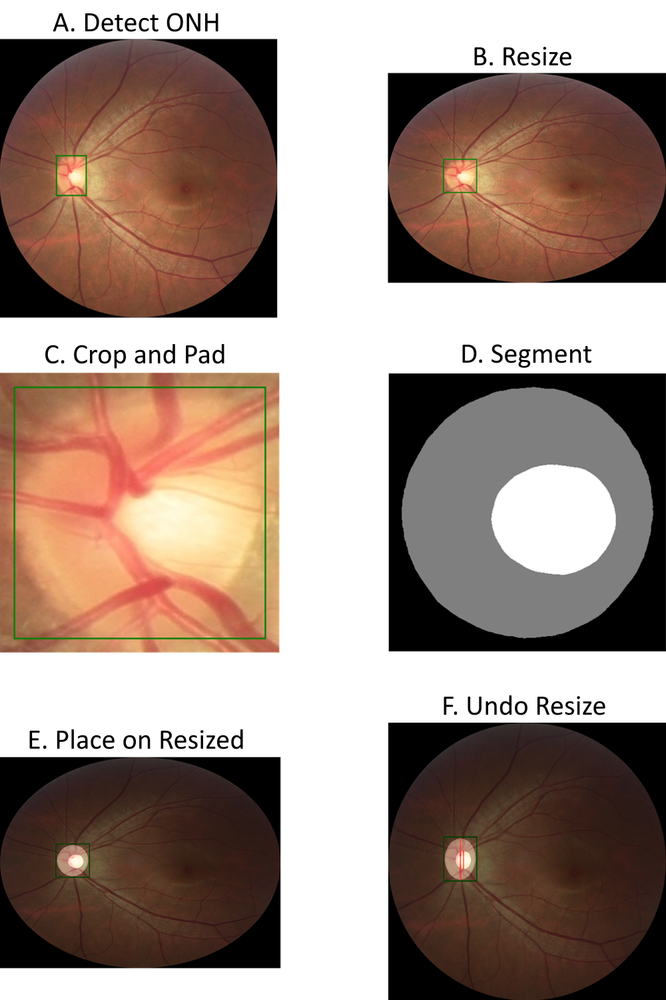

# Pipeline

For end-to-end full fundus to recovered segmentation

## Overview

This module allows user to specify folder of images, and retrieve segmentations via the pipeline on the original images in the folder.

See [scripts](./scripts/)

### Detailed Description

The following image shows in detail the process that is taking place:

Process to perform the cropping and resize technique to standardize inputs and recover the segmentation back onto the original image. A-C is facilitated by the detection model, and D-F is processed with the segmentation model. Stage F will provide the segmentation masks on the original fundus image with the clinical metric calculation
